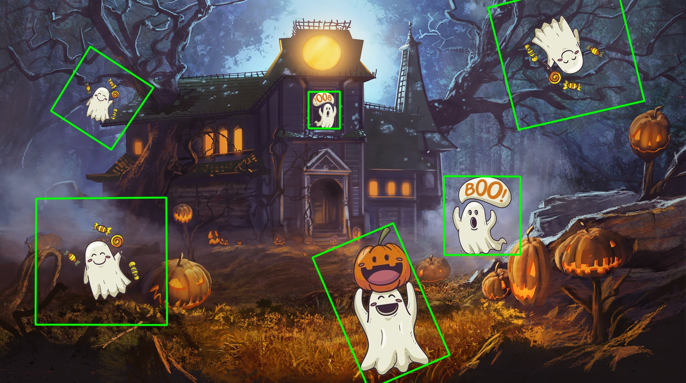

# 👻 Ghost Detector with OpenCV

This project implements a basic ghost detection system using feature matching techniques in OpenCV. The goal is to identify all instances of known ghost images within a larger test image. It was developed as a practical exercise to strengthen skills in image processing and computer vision using the `cv2` library.



---

## Project Purpose

This project is designed to:

- Practice using **OpenCV** for real-world image processing tasks  
- Understand how to work with **grayscale/color image formats**, **feature extraction**, and **homography**
- Learn how to use **SIFT** for keypoint detection and **BFMatcher** for matching features between images  
- Apply **perspective transforms** to locate and outline detected objects in an image

---

## How It Works

1. Load a set of known "ghost" images from a directory
2. Convert both the input (search) image and ghost images to grayscale
3. Use **SIFT (Scale-Invariant Feature Transform)** to extract keypoints and descriptors
4. Match the features between each ghost image and the input image using **BFMatcher**
5. Estimate the location of each ghost using **findHomography** and draw its outline on the image

---

## File Structure

```
/project_folder
│
├── hellowin/               
│   └── data_train          # Folder containing reference ghost images
│   └── lab7.png            # Image where ghosts should be detected
├── main.ipynb              # Main detection script
└── result.jpg              # Output image with detected ghosts outlined
```

---

## 🛠 Dependencies

- Python 3.x  
- OpenCV (`cv2`)  
- NumPy  

Install dependencies using:

```bash
pip install opencv-python numpy
```

---

## Example Output

Detected ghosts are outlined in green polygons on the final image.

